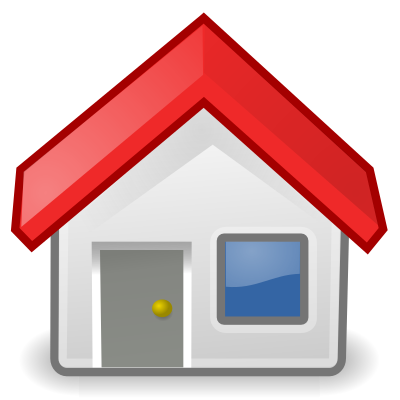

<div class="encabezado">
    <div class="h-izq">
        <h1 class="titulo-h1">Auronix University | <em>Curso SQL</em></h1>
    </div>
    <div class="h-der">
        
        
        
    </div>   
</div>
 

# ¿Por qué los índices pueden ser lentos? #

{:.justificado}
A pesar de la eficiencia del recorrido del árbol, existen casos en los que el índice no trabaja tan rápidamente como esperamos. El primer elemento de un índice lento es el encadenamiento de los nodos hoja. Tomando el ejemplo de la búsqueda del valor `57`, existen dos entradas que cumplen el filtro en la búsqueda. Al menos dos entradas son idénticas, sin embargo, el próximo nodo hoja podría contener nuevas entradas con el valor 57. La base de datos debe leer el próximo nodo hoja para validar si no existen más valores que cumplan los requisitos demandados. Esto significa que la búsqueda por el índice no solo necesita hacer el recorrido sobre el árbol, también debe hacer una búsqueda secuencial sobre los nodos hoja.

{:.justificado}
La segunda causa de búsquedas lentas aun usando un índice es tener que ir a la tabla. Hasta un nodo hoja simple podría contener varias veces el valor buscado. Los datos correspondientes de la tabla suelen estar diseminados entre varios bloques, esto significa que existe un acceso adicional a la tabla por cada valor encontrado dentro del índice.

{:.justificado}
Una búsqueda por índice requiere tres etapas:

1. El recorrido del árbol.

2. El recorrido sobre los nodos hoja.

3. El acceso a la tabla para devolver los datos del registro.

{:.justificado}
 El recorrido del árbol es la única etapa que tiene acceso a un número limitado de bloques, corresponde a la profundidad del árbol. Las otras dos etapas deberían tener acceso a muchos bloques que pueden ser la causa de la lentitud durante una búsqueda a través de un índice.
 
## Operaciones ##

Cuando la BD recibe una sentencia SQL, construye un plan de ejecución para poder resolver todos los elementos de la consulta, este plan ejecuta las operaciones necesarias para generar una respuesta en el menor tiempo posible. Existen tres operaciones que es necesario conocer para poder analizar la eficiencia de una consulta:

### INDEX UNIQUE SCAN ###

 Esta operación realiza unicamente el recorrido del árbol.

### INDEX RANGE SCAN ###
 
 {:.justificado}
 Ejecuta dos búsquedas, una logarítmica sobre el árbol y otra secuencial sobre los nodos hoja para encontrar todas las entradas correspondientes al filtro de la consulta.

### TABLE ACCESS BY INDEX ROWID ###

{:.justificado}
 Trae el registro desde la tabla, se ejecuta repetidamente para cada registro traido que cumpla con las condiciones del filtro en la consulta.

En una consulta SQL pueden presentarse una o más operaciones, el objetivo es construir los índices y las consultas de forma que el plan de ejecución para la consulta sea lo más eficiente posible. Pensemos en el siguiente ejemplo.

``` SQL
Select * from Tabla where columna2=57
```
{:.justificado}
El plan de ejecución para la consulta tendría las siguientes operaciones

{:.justificado}
* <code> INDEX UNIQUE SCAN </code> el recorrido del árbol (costo logarítmico).

{:.justificado}
* <code> INDEX RANGE SCAN </code> el recorrido secuencial sobre los nodos hoja para recuperar todas las llaves que coinciden con el criterio de búsuqeda.

{:.justificado}
* Dos operaciones <code> TABLE ACCESS BY INDEX ROWID </code> una por cada registro que coincida con el criterio de búsqueda.

{:.justificado}
El costo total de la consulta se obtiene sumando los costos de cada operación que aparezca en el plan de ejecución.

<div class="resumen">
    
    La rapidez con la que se ejecuta una consulta depende completamente de la correcta indexación en la BD y la construcción consciente de el enunciado <em>SQL</em>.
</div>
<br/><br/>


<style>
    *{
        box-sizing:border-box;    
    }
    body{
        padding:0px !important;
    }
    .wrapper{
        width:100% !important;

    }
    .wrapper header, .wrapper footer
    {
        display:none !important;
    }
    .wrapper section{
        float:none !important;
        width:80%;
        padding:0 0.5em !important;
        margin:0px auto;
        margin-top:80px;

    }
    @media print, screen and (max-width: 720px)
    {
        
    }
    .encabezado{
        background-color:black;
        color:white;
        position:fixed;
        width:100%;
        margin:0 0;
        left:0px;
        top:0px;
        z-index:100;

    }
    .h-izq{
        width:80%;
        float:left;
        margin:0px;
    }
    .h-der{
        text-align:right;
        width:20%;
        float:right;
        padding:5px;
        margin:0px;
    }
    @media print, screen and (max-width: 720px)
    {
        .wrapper section{
            margin-top:120px !important;
             width:90%;
        }
        .h-izq{
            width:60% !important;
            margin:0px;
        }
        .h-der
        {
            width:40% !important;
            margin:0px;
        }
        titulo-h1{
            font-size:20px;
        }
    }
    .encabezado div img{
        width:40px;
        border:none;
        margin:0px;
    }
    .titulo-h1{
        color:white !important;
        border:none !important;
        margin:0 !important;
        padding:15px !important;
    }
    .justificado{
        text-align:justify;
    }
    .img-centrada{
        text-align:center;
        margin:2em 1em;
    }
    .img-centrada img{
        width:100%;
    }
    .resumen{
        width:100%;
        margin:0px auto;
        /*background:#ebf3fc;*/
        background:#000;
        color:white;
        padding:1em;
        border-radius:10px;
        text-align:justify;
        box-shadow:0px 0px 5px gray;
        position:relative;
        padding-left:25px;
    }
    .sugerencia{
        width:100%;
        margin:0px auto;
        /*background:#ebf3fc;*/
        background:#000;
        color:orange;
        padding:1em;
        border-radius:10px;
        text-align:justify;
        box-shadow:0px 0px 5px gray;
        position:relative;
        padding-left:25px;
        text-align:center;
    }
    .sugerencia a:link,
    .sugerencia a:visited
    {
        color:orange;
    }
    .resumen img, .sugerencia img{
        width:40px;
        position:absolute;
        left:-20px;
        top:15px;
        border:none !important;
        box-shadow:none !important;
        margin:0px !important;  
        padding:2px;  
    }
    
</style>